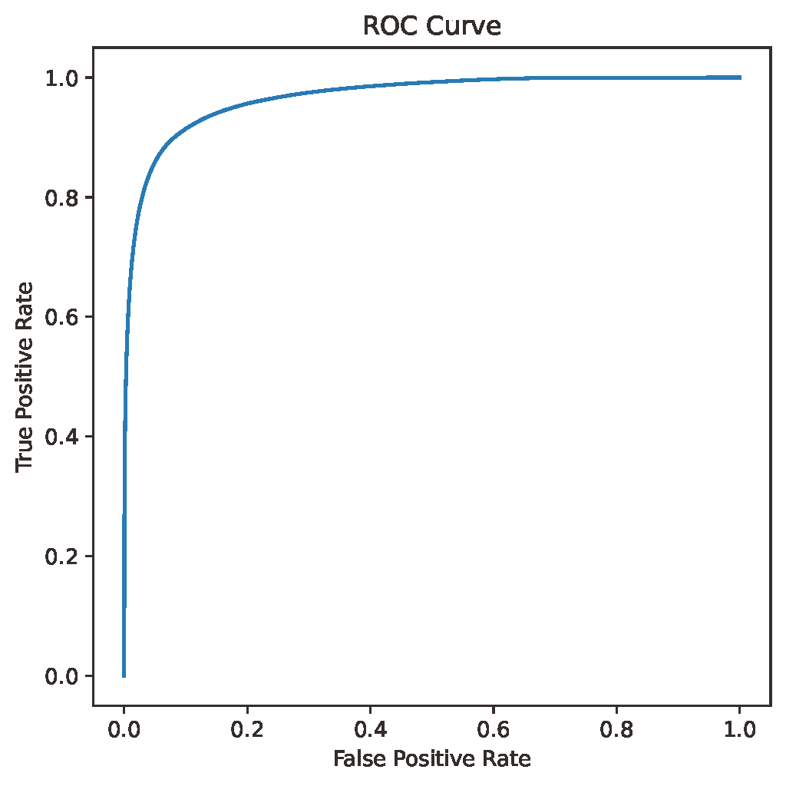
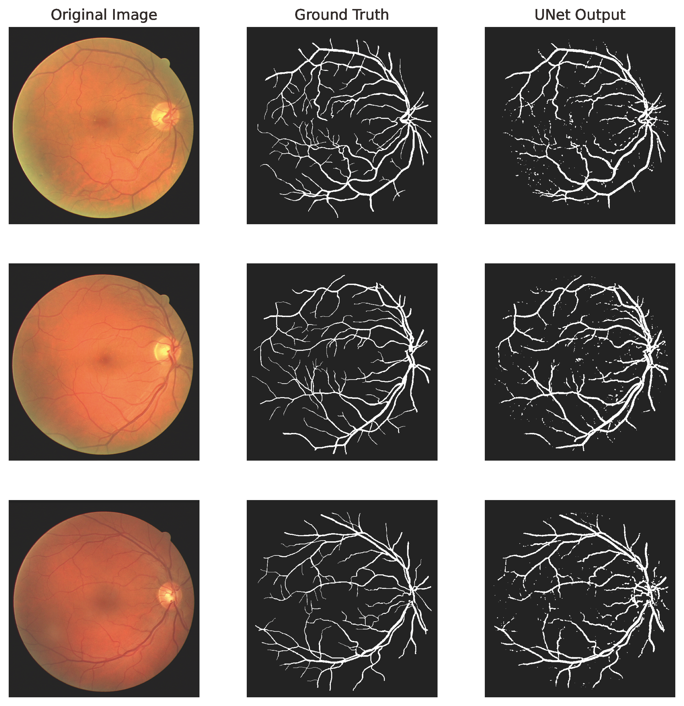

#  Segmentation of Blood Vessels in Retinal Images

Apply the U-Net to the  segmentation of blood vessels in retinal images. 

## Env

* python 3.7
* pytorch 1.10.1
* torchmetrics 0.9.0

## Dataset

[DRIVE: Digital Retinal Images for Vessel](https://drive.grand-challenge.org/)

## Network

Original paper by Olaf Ronneberger, Philipp Fischer, Thomas Brox:

[U-Net: Convolutional Networks for Biomedical Image Segmentation](https://arxiv.org/abs/1505.04597)


## Usage

Train the network: 

```sh
python train.py
```

Predict in the test dataset: 

```sh
python predict.py
```

you would expect the get the accuracy, precision, recall, specificity and ROC curve in the terminal. 

Here is the ROC curve. 



and here is the result (not very satisfactory ...):

